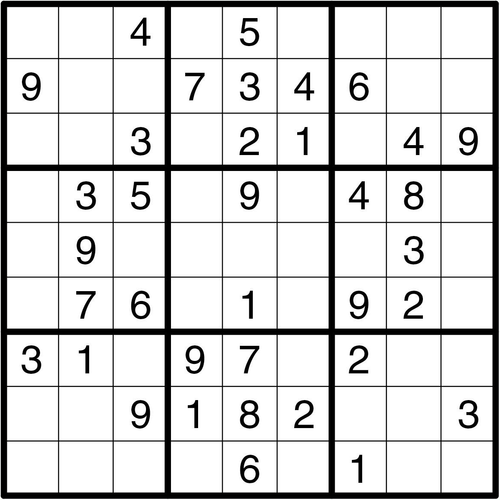

## Sudoku

Sudoku is a strategic puzzle game that is comprised of a 9x9-grid with numbers being pre-assigned to some squares. The goal is to fill in the empty squares with numbers ranging from one to nine. The constraint is that each unique number can only appear once in each row (horizontally), in each column (vertically), and in each of the nine blocks (3x3-grid). The relative difficulty of solving the sudoku is generally easier when more initial numbers are given.

<!--  -->

## Documentation

<!-- -Käyttöohje -->
- [Requirements](https://github.com/Ozath/ot-harjoitustyo/blob/master/documents/requirements.md)

<!-- -Arkkitehtuurikuvaus -->
<!-- -Testausdokumentti -->
- [Accounting of hours](https://github.com/Ozath/ot-harjoitustyo/blob/master/documents/accountingofhours.md)
