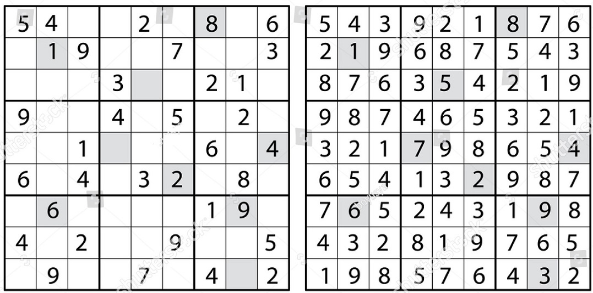

## Sudoku

Sudoku on älypeli, joka koostuu 9x9-ruudukosta, jossa ruutuihin on jaettu valmiiksi numeroita. Pelin tavoite on täyttää tyhjät ruudut hyödyntäen numeroita yhdestä yhdeksään. Rajoite on että jokainen numero saa olla vain kerran jokaisella rivillä (vaakasuoraan), jokaisessa sarakkeessa (pystysuoraan) ja lohkossa (3x3-ruudukossa). Pelin ratkaiseminen ja vaikeustaso on yleisesti helpompaa kun alussa on enemmän numeroita annettu valmiiksi.

## Dokumentaatio

<!-- -Käyttöohje -->
- [Vaatimusmäärittely](https://github.com/Ozath/ot-harjoitustyo/blob/master/sudoku/dokumentaatio/vaatimusmaarittely.md)

<!-- -Arkkitehtuurikuvaus -->
<!-- -Testausdokumentti -->
- [Tuntikirjanpito](https://github.com/Ozath/ot-harjoitustyo/blob/master/sudoku/dokumentaatio/tuntikirjanpito.md)
