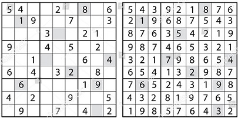

# Specification of requirements

### Purpose of the application

The application is a sudoku strategy game that the user can play. 

My plan is to use python instead of java to implement the project, as I've had time to learn a bit more python.

### User interface

The user interface for the applciation will comprise of one GUI window that will contain the gameboard, window menu items, and likely some textual components. The below picture is a placeholder for the gameboard. The image on the left being the initial board, with the image on the right being a solved board. The term grid refers to the gameboard and a cell refers to a numeric value in the grid.

### Functionality

This is a preliminary outline of features and ideas, which may be modified.

#### Overlay
 
- Menu items that enable the user to interact with the application. 
  - The menu items should probably have hotkeys. 
  - Perhaps implement purely as button functionality.
- Possibly make the games UI mostly usable by a mouse.
  - Scrolling menu for numbers inserted into cells.
  
#### Gameboard

- The user can select a new initial sudoku grid to solve at any time.
  - Initially use pre-built grids with rated difficulty from external sources (saved locally).
  - The grids difficulty level should be selectable by the user.
- The sudoku grids initial values can not be altered.
- The user can select a vacant cell and insert a number value in the range (1-9).
  - The user can modify these values.
  - The current game ends when the last cell is successfully filled and constraints checked. 
- The user can save his current progress and resume the sudoku at a later time. 

### Further development ideas

- Expand functionality of the sudoku grids difficulty level.
  - Use a randomly generated grid by the application (AI).
  - Integrate to use live fetched grids from external sources.
- Auto-checker for game grid.
  - Entering an invalid number into a cell can alert the player immediately.
  - Use highlighting/colors for valid/invalid number placements.
  - A helper option.
